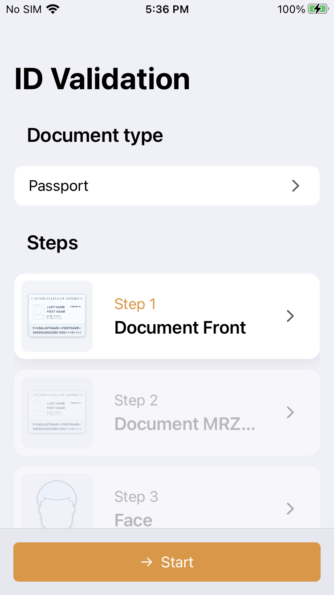
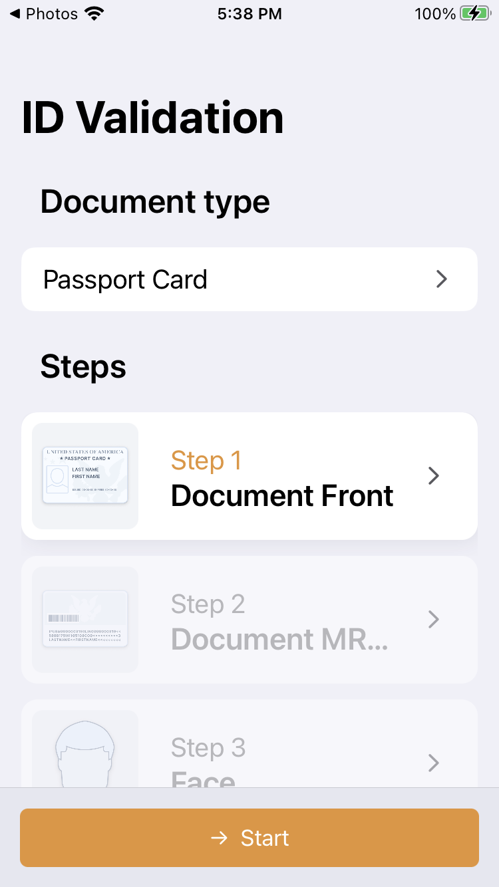

# DIVE SDK for iOS

The DIVE iOS SDK the library integrates the component of capturing the documents and faces from a video to your iOS applications.
Here is a [Demo project](https://github.com/IDScanNet/DIVE-SDK-Demo-iOS)

## Overview

Upon being switched on, the library integrates the component of capturing the documents and faces from a video to your iOS App.

## Use cases

- Capture and determination of the document type
- Capture of pdf417
- Capture of MRZ
- Capture of faces
- Sending captured documents to DIVE API

## Recommendations

The capture must be made in a well-lighted room. A document must be located at the uniform background.

## Limitations

Only iOS platform
Minimum deployment target of iOS 13.0

## Request a DIVE/DIVE Online Username and Password from IDScan.net

Email [support@idscan.net](mailto:support@idscan.net) for a DIVE Online Username and Password

## Installation

### Adding **DIVE-SDK-iOS** to a `Package.swift`

To install the DIVE iOS SDK using Swift Package Manager (SPM):

Add the DIVE-SDK-iOS package to your `Package.swift` file:

```swift
// swift-tools-version:5.3
import PackageDescription

let package = Package(
    name: "YourProjectName",
    platforms: [
        .macOS(.v10_15),
        .iOS(.v13)
    ],
    dependencies: [
        .package(url: "https://github.com/IDScanNet/DIVE-SDK-iOS.git", from: "3.0.0")
    ],
    targets: [
        .target(
            name: "YourProjectName",
            dependencies: [
                .product(name: "DIVE-SDK-iOS", package: "DIVE-SDK-iOS")
            ]
        ),
        ...
    ]
)
```

---

### Installing from Xcode (relevant for both Swift and Objective-C projects)

Add the package by selecting `Your project name` → `Package Dependencies` → `+`.


Search for the **IDScanIDDetector** using the repo's URL:

```console
https://github.com/IDScanNet/DIVE-SDK-iOS
```

Next, set the `Dependency Rule` to be `Up to Next Major Version` and specify the latest version of the package as the lower bound.

Then, select `Add Package`.


Choose the detectors that you want to add to your project.


---

## Localization

You can localize the SDK in the usual way. You can see the localization keys in the [Localizable.strings](Libs/Localizable.strings) file.

# Usage DIVE SDK Online

Using the [web portal](https://diveonline.idscan.net/) or [DIVE API](https://docs.idscan.net/dive/dive-online/api-manual.html) you can create Applicant and use applicant id for checking their documents. Use [Create applicant request](https://docs.idscan.net/dive/dive-online/swagger.html#/Applicants/post_api_v2_private_Applicants) by API

In the context of the DIVE Online Web API, the term "applicant" typically refers to the person who is submitting their identification documents for validation. The applicant is the individual whose data is being extracted from the submitted documents, such as their name, date of birth, address, etc.

When making a new validation request using the API, you can provide information about the applicant in the request body, including their first name, last name, phone number, email address, and any additional metadata you want to store. This information is associated with the validation request and can be used to identify the applicant and their submitted documents.

Once you are logged in to the DIVE Online Web Portal create both secret and public tokens, use `public tokens` in your application. Secret tokens can be used to create applicants or for other protected [API methods](https://docs.idscan.net/dive/dive-online/swagger.html).

Create `your_integration_id` in [Bundles page](https://diveonline.idscan.net/bundles) of the DIVE Online portal
click `+ Add Bundle` named it and click `add`. Use `Token` from Bundles table as `your_integration_id`

### Initialization

```swift
DIVEOnlineSDK(applicantID: String,
              integrationID: String,
              token: String,
              baseURL: String,
              delegate: DIVESDKDelegate,
              theme: DIVESDKTheme? = nil)
```

- **applicantID**: The applicant's ID.
- **integrationID**: The integration ID.
- **token**: The authorization token for network requests.
- **baseURL**: The base URL for network requests.
- **delegate**: An object conforming to `DIVESDKDelegate` to handle SDK events.
- **theme**: An optional `DIVESDKTheme` object for customizing the SDK's appearance.
    - **accentColor**: `UIColor` (Swift) / `UIColor *` (Objective-C) The main color used for buttons and titles in the SDK. This should be a valid `UIColor` object. Example: `.blue` (Swift) / `[UIColor blueColor]` (Objective-C)
    - **fontSizeModifier**: `CGFloat`  A number that is added to the base font size, allowing you to adjust the overall font size within the SDK. Example: `2.0`

Accent Color (orange)              |  Font Size Modifier (2.0)
:-------------------------:|:-------------------------:
  |  

By using the `theme` parameter, you can ensure that the SDK components integrate seamlessly with the visual style of your application.

### Usage example

```swift
import UIKit
import DIVEOnlineSDK
import DIVESDKCommon

class ViewController: UIViewController, DIVESDKDelegate {
    let sdk: DIVEOnlineSDK?
    
    override func viewDidLoad() {
        super.viewDidLoad()
        sdk = DIVEOnlineSDK(applicantID: "your_applicant_id",
                            integrationID: "your_integration_id",
                            token: "your_public_token",
                            baseURL: "https://stage.api-diveonline.idscan.net/api/v2",
                            delegate: strongSelf,
                            theme: .init(accentColor: .green, fontSizeModifier: 5))

        sdk?.loadConfiguration {  [weak self] error in
            guard let self = self else { return }
            if let error = error {
                print("Configuration load error: \(error)")
            } else if let sdk = self.sdk, sdk.ready {
                sdk.start(from: self)
            }
        }
    }

    // MARK: - DIVESDKDelegate

    func diveSDKDataPrepaired(sdk: IDIVESDK, data: DIVESDKData) {
        sdk.close()
        
        //You can do something with the captured data and decide whether to send it.
        sdk.sendData(data: data)
    }
    
    func diveSDKResult(sdk: IDIVESDK, result: [String: Any]) {
        print("DIVE SDK Result: \(result)")
    }
    
    func diveSDKError(sdk: IDIVESDK, error: Error) {
        print("DIVE SDK Error: \(error.localizedDescription)")
    }

    func diveSDKSendingDataProgress(sdk: IDIVESDK, progress: Float, requestTime: TimeInterval) {
        print("Progress: \(progress), Time: \(requestTime)")
    }
}
```

# Usage DIVE SDK

Using the [web portal](https://mydive.idscan.net/overview) create both public tokens, use `public tokens` in your application.

### Initialization

#### Swift

```swift
DIVESDK(configuration: [String : Any],
        token: String,
        delegate: DIVESDKDelegate,
        theme: DIVESDKTheme? = nil)
```

- **configuration**: A dictionary containing the configuration settings for the SDK.
- **token**: The authorization public token for network requests. 
- **delegate**: An object conforming to `DIVESDKDelegate` to handle SDK events.
- **theme**: An optional `DIVESDKTheme` object for customizing the SDK's appearance.
    - **accentColor**: `UIColor` (Swift) / `UIColor *` (Objective-C) The main color used for buttons and titles in the SDK. This should be a valid `UIColor` object. Example: `.blue` (Swift) / `[UIColor blueColor]` (Objective-C)
    - **fontSizeModifier**: `CGFloat`  A number that is added to the base font size, allowing you to adjust the overall font size within the SDK.

### Configuration for `DIVESDK`

The `configuration` parameter for `DIVESDK` is a dictionary that defines the settings and behaviors for the SDK. This configuration determines how the SDK captures and processes ID documents.

### Configuration Options

- **autoContinue**: `Bool`
  - When set to `true`, the SDK automatically proceeds to the next step after a successful capture.
 
- **autoStart**: `Bool`
  - Allows you to start capture processing immediately without explicitly pressing the Start button on the Summary Screen.
 
- **autoSubmit**: `Bool`
  - Allows you to submit captured data immediately without explicitly pressing the Submit button on the Summary Screen.

- **realFaceMode**: `String`
  - realFaceMode (string) - an option that enables advanced image capturing with volumetric face detection. Available values: 'auto', 'all', 'none'.
    auto - enable "realFaceMode" only for iPhones
    all - enable "realFaceMode" for all devices
    none - disable this option

- **isShowDocumentTypeSelect**: `Bool`
  - if only one document type is configured in the documentTypes array AND this setting is set to false the document type dialog will not be displayed to the end user. Default: true.

- **documentTypes**: `Array<Dictionary>`
  - Defines the types of documents that the SDK should recognize and process. Each document type can have multiple steps for capturing different parts of the document.

- **licenseKey**: `String`
  - Your license key for using the SDK.

### Document Type Configuration

Each document type in the `documentTypes` array is a dictionary with the following fields:

- **isActive**: `Bool`
  - Indicates whether the document type is active and should be processed.

- **type**: `String`
  - The type of document (e.g., `ID`, `Passport`, `PassportCard`, `GreenCard`, `InternationalId`).

- **steps**: `Array<Dictionary>`
  - An array of steps required to capture the document. Each step is a dictionary with the following fields:
    - **type**: `String`
      - The type of step (e.g., `front`, `pdf`, `mrz`, `face`).
    - **name**: `String`
      - The name of the step as displayed to the user.
    - **mode**: `Dictionary`
      - Specifies the modes available for capturing the step. Possible modes include `uploader` and `video`.

### Example Configuration

```swift
let configuration: [String: Any] = [
            "autoContinue": true,
            "autoStart":false,
            "autoSubmit":false,
            "isShowDocumentTypeSelect":false,
            "realFaceMode": "auto",
            "documentTypes": [
                [
                    "isActive": true,
                    "type": "ID",
                    "steps": [
                        [
                            "type": "front",
                            "name": "Document Front",
                            "mode": [
                                "uploader": true,
                                "video": true
                            ]
                        ],
                        [
                            "type": "pdf",
                            "name": "Document PDF417 Barcode",
                            "mode": [
                                "uploader": true,
                                "video": true
                            ]
                        ],
                        [
                            "type": "face",
                            "name": "Face",
                            "mode": [
                                "uploader": true,
                                "video": true
                            ]
                        ]
                    ]
                ],
                // Other document types ...
            ],
            "licenseKey": "your_license_key"
        ]
```

 `License keys` can be take on the web portal in the [Access Tokens page](https://mydive.idscan.net/tokens).
If these keys are not present, follow these steps
- Share your application's bundle id with IDScan.net support
- IDScan.net support will then share with you a license key

#### `DIVESDK` Methods

- **start(from: UIViewController)**: Starts the ID capture process.
- **close()**: Closes the ID capture process.

### Usage example

```swift
import UIKit
import DIVESDK
import DIVESDKCommon

class ViewController: UIViewController, DIVESDKDelegate {
    var diveSDK: DIVESDK?

    override func viewDidLoad() {
        super.viewDidLoad()
        
        let configuration: [String: Any] = ["key": "value"]
        let token = "your_token"
        
        diveSDK = DIVESDK(configuration: configuration,
                          token: token,
                          delegate: self,
                          theme: nil)
        
        if let sdk = diveSDK, sdk.ready {
            sdk.start(from: self)
        }
    }

    // MARK: - DIVESDKDelegate

    func diveSDKDataPrepaired(sdk: IDIVESDK, data: DIVESDKData) {
        sdk.close()
        
        //You can do something with the captured data and decide whether to send it.
        sdk.sendData(data: data)
    }
    
    func diveSDKResult(sdk: IDIVESDK, result: [String : Any]) {
        print("Result: \(result)")
    }
    
    func diveSDKError(sdk: IDIVESDK, error: Error) {
        print("Error: \(error)")
    }
    
    func diveSDKSendingDataProgress(sdk: IDIVESDK, progress: Float, requestTime: TimeInterval) {
        print("Progress: \(progress), Time: \(requestTime)")
    }
}
```

## Result explaining

 Here's a table explaining the key-value pairs in the `result` dictionary returned by the `diveSDKResult` method:

| Key | Value Type | Description |
| --- | --- | --- |
| `validationRequestId` | `String` | The unique ID of the validation request. |
| `document` | `NSDictionary` | A dictionary containing the identified document's data. |
| `documentFailStatusReasons` | `NSArray<String>` | An array of reasons if the document validation failed. |
| `faceFailStatusReasons` | `NSArray<String>` | An array of reasons if the face validation failed. |
| `invalidDataErrors` | `NSArray<NSDictionary>` | An array of dictionaries containing the code and message for any invalid data errors. |
| `validationResponseId` | `NSInteger` | The unique ID of the validation response. |
| `created` | `NSString` | The date and time when the validation response was created |
| `documentType` | `NSString` | The type of the identified document (e.g., "passport", "driverLicense"). |
| `documentTypeInt` | `NSInteger` | The integer representation of the document type. |
| `status` | `NSInteger` | The validation status of the document (0: valid, 1: fake, 2: data error, 3: server error). |
| `validationStatus` | `NSDictionary` | A dictionary containing the validation status of the document and face. |
| `validationStatus.expired` | `BOOL` | A boolean indicating whether the document is expired or not. |
| `validationStatus.documentIsValid` | `BOOL` | A boolean indicating whether the document is valid or not. |
| `validationStatus.faceIsValid` | `BOOL` | A boolean indicating whether the face in the document matches the user's face or not. |

Listed below are the possible values and descriptions:

*   **- status** - possible values: 0, 1, 2, 3

    `0` - document is valid

    `1` - document is fake

    `2` - data error. If a document is of poor quality and we are not able to identify it, this status will be shown. Also in the field "InvalidDataErrors" there will be a list of problems related to the code and to the message.

    `3` - server error during the document identification

*   **- validationStatus** - list of meanings for validation steps.

   `expired` - whether the license is valid at the moment of validation or not

   `documentIsValid` - whether a document is valid or not

   `faceIsValid` - whether the face in the document coincides with the face of the user.

> [!NOTE]
> `expired` - does not influence the final decision with respect to the validity of the document and only serves as a guideline.
